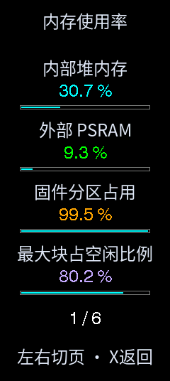
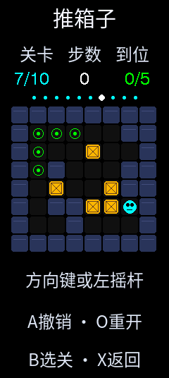

# ESP32-S3 多功能遥控器
### 复刻与二次开发 · 中文界面 · 蓝牙控制 · CLion / PlatformIO

基于立创开源硬件平台的 [《ESP32 万能遥控器》](https://oshwhub.com/bukaiyuan/ESP32-hang-mu-yao-kong-qi)。原项目发布账号为 **bukaiyuan**；原系统源码文件头署名为 **bilibili-黑人黑科技**。本仓库二次开发与维护账号为 **WU-AetherCore**。**AeroPad** 是本派生工程的内部标识，用于目录、构建配置及蓝牙名称，不是原项目名称，也不是原作者姓名。

原代码和资源的署名保留，来源及各组件许可见 [作者与来源](NOTICE.md)、[第三方声明](THIRD_PARTY_NOTICES.md) 和 [LICENSE](LICENSE)。

## 当前联调限制

**C30D 阿克曼实车控制尚未验收通过。** 已恢复左右转向并完善官方 APP/ROS 反馈解析，但实测仍出现 BLE 保持连接、接收数据冻结且停车未获确认的情况。界面“停车未确认”不代表车辆已经停转；请停止运动测试并关闭车辆电源。接收端独立失联停车与冻结根因仍待直连调试，不能无人值守或以高速运行作为验收。见 [C30D 协议与排查记录](docs/BLUETOOTH_PROTOCOL_CONTROL.md)。

## 从这里开始

|你要做什么|对应资料|
|---|---|
|第一次了解项目、查看完整菜单|[项目与源码导览](docs/PROJECT_GUIDE.md)|
|在 CLion 编译、烧录到自己的遥控器|[构建与烧录](docs/BUILD_AND_FLASH.md)|
|查看硬件引脚、校准、按键和进退界面|[硬件与操作](docs/HARDWARE_AND_CONTROLS.md)|
|让另一块板子接收数据并控制自己的设备|**[接收端接入教程](docs/RECEIVER_INTEGRATION.md)**|
|查每个控制字段、字节、CRC和示例|**[控制数据协议 v1](docs/CONTROL_PROTOCOL.md)**|
|判断发送格式、回显、波特率与乱码|[连接与数据排查](docs/TROUBLESHOOTING.md)|
|配置手机/电脑热点配网|[WiFi 管理](docs/WIFI_MANAGEMENT.md)|
|查看设备内存、固件占用和蓝牙统计|[设备监测](docs/DEVICE_MONITOR.md)|
|玩本机游戏、了解推箱子闯关操作|[游戏玩法](docs/LOCAL_GAMES.md)|
|查当前测试边界与历史修改|[验证状态](docs/VALIDATION.md) · [更新记录](CHANGELOG.md)|

## 三种通信方式，先选对入口

|入口|通信方式|接收端需要做什么|当前状态|
|---|---|---|---|
|蓝牙中心 → 蓝牙游戏手柄|标准 BLE HID 游戏手柄|电脑/手机配对，由支持手柄的软件读取输入|已实现；游戏兼容性取决于软件|
|蓝牙中心 → 蓝牙模块控制|遥控器作为 BLE 客户端，写 NUS 或 FFE0/FFE1 模块|模块透传到 UART，目标程序按本仓库 v1 协议解析、映射执行器|已实现发送与通知回显|
|NRF遥控 → 无人机 / 四驱车|nRF24L01|通用NRF接收端输出SBUS或差速电机接口|**已实现；真实飞控/电机联调待验证**|

自定义 v1 帧不等于 HID 报告，也不等于原作者 NRF 结构体。WiFi 网页用于配置和查看数据，当前不向车辆下发控制指令。

## 已实现功能

- 双摇杆、双 ADC 旋钮、18路按键/拨杆及两路归一化倾角数据；引导校准、死区、极限与 NVS 掉电保存。
- 统一中文菜单、绿色已连接/黄色未连接、独立操作说明；按键测试、姿态立方体、六页设备监测。
- BLE 模块扫描、连接、选中长名称滚动、四种控制发送格式、九档发送间隔、五种 USB 接收回显。
- WiFi 热点配网、进入管理界面自动连接选项、网页状态和控件数据查看。
- 贪吃蛇、打砖块、飞机大战、2048、俄罗斯方块、10关推箱子；推箱子连续撤销、庆祝动画与自动切关。

网络信息仅保留 WiFi 管理，已移除三个未使用的信息页面。远程 UART 参数设置需要对方实现扩展服务；仅扫描到名称不能确定模块芯片或其 AT 指令。

## 当前界面

以下三张是整理仓库时通过串口回读的设备帧缓冲，240×536，未使用模拟效果图或摄像头照片。

|主菜单|设备监测|推箱子|
|:---:|:---:|:---:|
||||

[截图说明](docs/images/README.md) 记录采集方式和限制。

## 快速编译

目标硬件：ESP32-S3、16MB Flash、8MB OPI PSRAM、RM67162 AMOLED。先按 [构建说明](docs/BUILD_AND_FLASH.md) 安装 PlatformIO，再运行：

```powershell
pio run -e aeropad
pio run -e aeropad -t upload --upload-port COM11
```

COM11 是维护者的遥控器端口，其他电脑应改为自己的真实端口。Windows 脚本为 `build.cmd`、`flash.cmd`、`monitor.cmd`。CLion 保留 **AeroPad** preset：构建 **firmware** 编译，构建 **upload** 烧录。

## 接收端示例在哪里

- [BLE-UART桥接示例](examples/AeroPad-BLE-Receiver/README.md)：另一块 ESP32-S3 接收无线数据，原样转发到 UART，回传 UART 字节；**不驱动电机**。
- [串口解析与控制映射示例](examples/Serial-Control-Receiver/README.md)：另一块 ESP32-S3 解析二进制帧、校验CRC、处理失联，打印左右电机控制意图；适配 `applyOutputs()` 后才能驱动你的电机。
- [Python四格式接收器](examples/host_receiver.py)：电脑从串口接收二进制/JSON/HEX/文本，显示解析结果和控制意图。
- [可移植 C++11 解析器](examples/common/ControlReceiver.h)：UART/STM32/其他 MCU 可复用的二进制流解析和看门狗。

接收端工程使用自己的串口，**不要把接收端固件刷入遥控器 COM11**。接入步骤、接线、字段映射和失联动作见 [接收端教程](docs/RECEIVER_INTEGRATION.md)。

## 发布范围

仓库发布源码、协议、示例、说明和测试，不包含原硬件设计文件或组合固件下载。派生软件许可为 GPL-3.0-only；RF24 的 GPL-2.0-only 与 GPL-3.0 组合二进制再分发问题尚未解决，详情见第三方声明。字体、显示驱动及其他依赖仍适用各自许可。

NRF 遥控新增[NRF 调试](docs/NRF_DEBUG.md)：模块检测、射频参数、测试启停、ACK/收发统计和采样数据。车型控制与通用接收端见 [NRF 控制说明](docs/NRF_CONTROL.md)。

NRF 设置与原始数据互通：[操作、参考程序预设及数据布局](docs/NRF_SETTINGS.md)。

无人机/四驱车自定义协议：停止控制后长按B打开设置菜单。各自 5 个独立预设，支持逐字节数据映射及掉电保存，见 [配置与预设说明](docs/NRF_CUSTOM_PROFILES.md)。

预设入口：停止后长按B → 我的预设 → 应用为默认预设，O确认回到遥控，再按O发送。控制退出改为B+X同时保持350ms。前后纵轴与转向横轴可选择左右摇杆、分别反转，并随预设保存。

- 蓝牙中心首项「蓝牙协议遥控」：单一WHEELTEC C30D车型（APP/ROS接口可选），摇杆比例调速、旋钮限速和25%以内启动检查、0～3500mm/s可设上限，自定义1～32字节映射、校验和停止帧，五个预设及掉电恢复。详见[蓝牙协议遥控](docs/BLUETOOTH_PROTOCOL_CONTROL.md)。BLE UART制式须与小车模块匹配。

### 无线互斥运行

无线功能只在对应界面运行：WiFi管理开启WiFi；蓝牙游戏手柄开启HID广播；蓝牙协议/模块控制开启BLE扫描与连接；NRF控制/调试开启NRF。退出页面关闭对应无线活动，WiFi热点和网页会断开，路由器、校准及预设配置保留。自动连接设置现指进入WiFi管理时自动连接，不在开机或其他控制页面后台连接。
