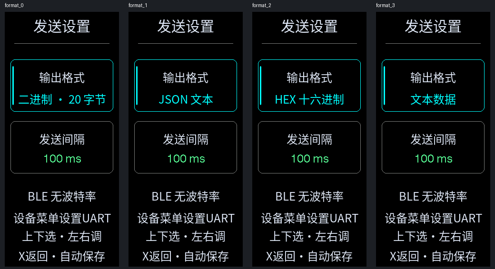
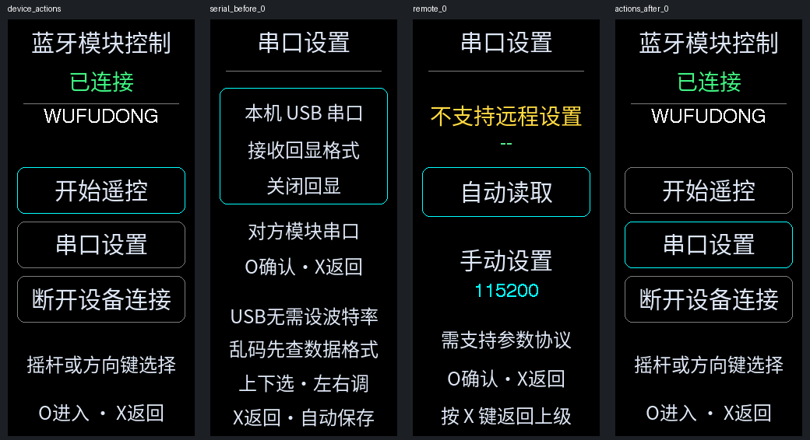

# AeroPad ESP32 Controller

ESP32-S3 遥控器的 CLion / PlatformIO 二次开发，240×536 AMOLED 中文界面，双摇杆、双ADC旋钮、按键/拨杆与MPU6050。基于 [卜开元 / bukaiyuan《ESP32 万能遥控器》](https://oshwhub.com/bukaiyuan/ESP32-hang-mu-yao-kong-qi)，原系统源码署名 **bilibili-黑人黑科技**；本项目维护与修改：**WU-AetherCore**。

保留原作者署名和来源，派生软件 GPL-3.0-only；字体及第三方组件分别保留许可。见 [NOTICE](NOTICE.md)、[LICENSE](LICENSE)、[第三方声明](THIRD_PARTY_NOTICES.md)。不是原作者官方版本。本仓库发布源代码与文档，不包含原硬件设计文件，不提供组合固件二进制下载。

## 功能

- 系统设置 → 设备监测：六页内存/PSRAM/固件百分比、硬件、WiFi及蓝牙统计，100ms刷新；独立监测和校准图标。见 [设备监测说明](docs/DEVICE_MONITOR.md)。

- 网络信息 → WiFi 管理：热点配网、路由器凭据掉电保存、中文网页状态和实时控件数据。操作见 [WiFi 管理说明](docs/WIFI_MANAGEMENT.md)。

- 固定字号中文菜单，标题30px、正文24px、状态28px；已连接绿色，未连接黄色，操作说明白色。
- 标准BLE HID游戏手柄，六模拟轴、14按钮与方向帽，实时连接状态。
- BLE模块搜索、选中长名称滚动、NUS/FFE0连接、控制数据发送及通知回显。
- 二进制20字节、JSON、HEX、文本四格式；20/50/100/200/250/500/1000/1500/2000ms九档间隔，掉电保存。
- 串口设置位于蓝牙模块控制内：本机USB回显支持关闭、原始二进制、HEX、文本、JSON五种格式；同时提供支持扩展协议的对方UART参数设置。
- 摇杆中心/极限和两个旋钮极限校准，NVS保存；按键测试左右框101×101，陀螺仪框60×60。
- MPU6050姿态立方体，静置校准、归零、暂停。局部刷新与子页面返回全页重画。

- 本机游戏：贪吃蛇、打砖块、飞机大战、2048、俄罗斯方块、推箱子，支持摇杆/按键操作、最高分或解锁进度保存。见 [游戏玩法](docs/LOCAL_GAMES.md)。
- 推箱子提供10关递增挑战、已解锁关卡重玩、128步撤销、墙角提示、动态庆祝和3.2秒自动切关；固定地图均经过求解验证。

NRF只保留无人机和四驱车，待接收端协议；网络信息中的哔哩哔哩、天气及股票入口尚未实现，WiFi管理已实现。




## 构建与烧录

目标：ESP32-S3，16MB Flash、8MB OPI PSRAM、RM67162。不同板子先核对 `src/pins_config.h`、`src/controller_keys.h` 和显示接线。安装PlatformIO Core：

```powershell
python -m pip install platformio==6.1.18
pio run -e aeropad
pio run -e aeropad -t upload --upload-port COM11
pio device monitor -p COM11 -b 115200
```

端口可在platformio.ini修改，烧录前关闭占用串口的助手/监视器。Windows默认PlatformIO环境 `%USERPROFILE%\.platformio\penv` 可用 `build.cmd` / `flash.cmd`。

CLion打开根目录，先执行一次PlatformIO构建安装工具链，再加载 **AeroPad** CMake preset。选择 **firmware** 目标点击构建编译；选择 **upload** 目标点击构建烧录。ESP32固件不作为电脑应用运行。CMake入口针对Windows CLion，需要Ninja；Linux/macOS使用PlatformIO命令。

```powershell
cmake --preset AeroPad
cmake --build --preset firmware
cmake --build --preset upload
```

## 操作

|页面|进入/选择|退出/特殊动作|
|---|---|---|
|主菜单|左右方向键，O进入|主菜单不拦截摇杆|
|子菜单|方向键或左摇杆，O进入|X返回|
|蓝牙游戏手柄|电脑配对后HID输出|B+X同时返回，单独按键是控制输入|
|模块列表|方向键/摇杆，O连接，A搜索|X返回蓝牙中心，B进入模块设置|
|模块设置|串口设置/发送设置，O进入|X返回列表|
|已连接设备操作|开始遥控、串口设置、断开|X断开；遥控中B+X返回设备操作并发送释放帧|
|串口设置|上下选本机/对方；本机左右选回显；对方O进入|X逐级返回|
|发送设置|上下选格式/间隔，左右调整|X返回，即改即存|
|按键测试|所有控件保留测试用途|必须B+X同时返回系统设置|
|校准|按引导采集中心/极限，最后O保存|X取消草稿；有效微调立即保存|
|立方体|O归零，A暂停/继续，B静置校准|X返回|

摇杆菜单先回中，超过55%移动，回中25%，长推450ms后每180ms重复；采集/遥控/按键测试不拦截轴输入。

## 协议与乱码

**[完整控制数据协议](docs/CONTROL_PROTOCOL.md)** 包含每个字段、18个按钮bit、字节长度、端序、CRC、示例、BLE分片及间隔带宽计算。标准游戏手柄HID与此模块协议独立。

串口助手文本接收请选择JSON/文本；二进制使用HEX接收。HEX发送本身是ASCII字节值表示。对方电气UART参数仍需一致，BLE与USB CDC不靠UART波特率传输。

WUFUDONG实机FFE0连接已测，但未提供远程UART参数接口，不凭设备名猜AT命令。兼容扩展服务与另一块ESP32接收板的示例见 [AeroPad-BLE-Receiver](examples/AeroPad-BLE-Receiver)，不要将接收端刷入遥控器COM11。

## 硬件、校准与验证

四轴GPIO：LX2、LY1、RX16、RY15，旋钮14/3；MPU6050为0x68，MCP23017为0x27。原蜂鸣器与RX共享GPIO16，当前禁用，确认独立接线后才能启用。

有效校准保存到Flash NVS，复位/掉电恢复，不开机覆盖中心。完整引导最终确认才保存；无效微调拒绝。ADC0～4095与遥控输出-100～100不同。MPU无磁力计，航向仅相对角度，静置零偏不覆盖摇杆NVS。

2026-10-06，本地主机协议/导航/投影测试通过，两个固件编译通过，遥控器COM11烧录Hash通过。实机四格式/九间隔、复位保存、连续嵌套串口页面往返通过，逻辑帧与SPI实际提交帧一致，抓取的中文界面逐页检查。

电脑HID连接/断开/重连已测，WUFUDONG连接已测；未完整验证电脑串口助手实时接收窗口、全部物理动作、游戏兼容性或远端UART设置。SPI提交帧不是摄像头拍摄，独立接收端只编译。GitHub Actions仅构建/主机测试，不访问硬件。

```sh
g++ -std=c++17 tools/test_control_packet.cpp -o test_protocol
./test_protocol
```

重建中文位图：安装Pillow后 `python tools/rebuild_ble_ui.py`，使用仓库OFL字体；正常构建无需Pillow。RF24 GPL-2.0-only与原项目GPL-3.0的组合二进制许可兼容性尚需处理，本次不发布该组合二进制，详见第三方声明。
